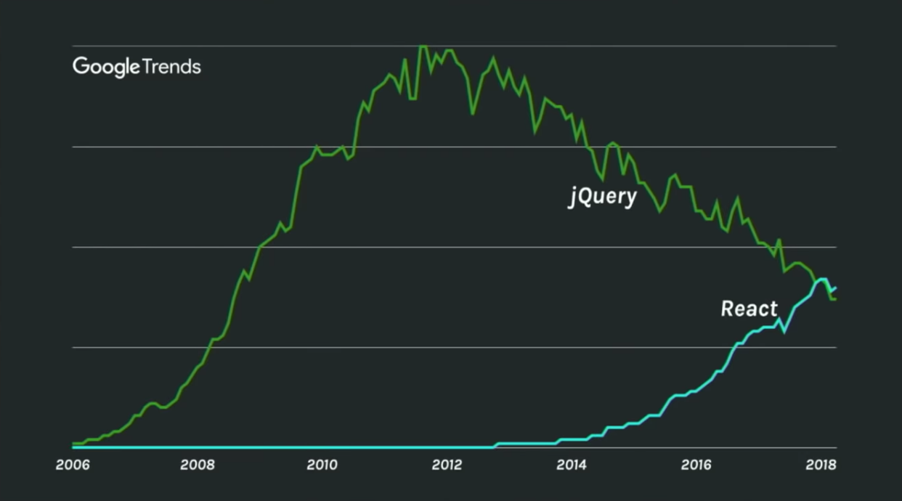
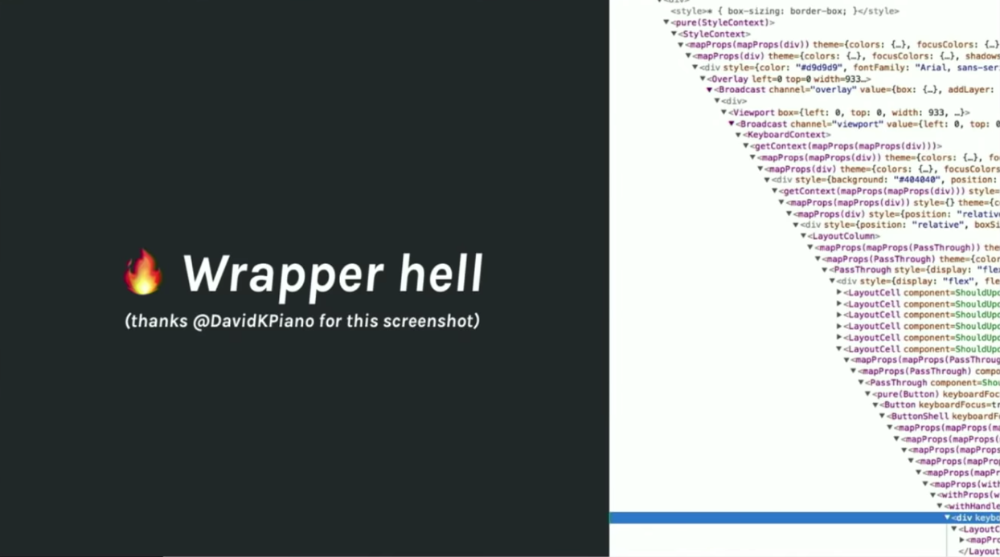

좋은 기회를 얻어 라스베가스에서 이틀간 진행된 [React Conf 18](https://conf.reactjs.org/)에 다녀왔다. 올해 React conf에선 Hooks, Concurrent React 등의 react의 새로운 컨셉의 소개와 더불어 전세계 개발자들과 함께 더 나은 UI/UX 개발에 대한 고민과 문제점에 대한 접근 방식, 그리고 이를 해결하기 위해 어떤 노력하고 있는지에 대한 여러 경험을 듣고 공유할 수 있었다.

## React의 오늘과 미래

첫 keynote는 React의 현재 위치와 앞으로의 비전에 대한 세션이었다.


_어느덧 jquery를 앞서나가고 있는 react..(출처 : https://youtu.be/V-QO-KO90iQ)_

> Make it easier to build great UIs

react engineering manager인 Sophie Alpert가 소개한 react의 핵심 미션이다. react가 내세우고 있는 선언적이고 컴포넌트 중심의 개발, 그리고 그 주위로 구축된 여러 커뮤니티와 에코시스템들이 결국엔 훌륭한 UI를 보다 쉽게 만들기 위함이라는걸 말하고 있는것 같다.
또한 그들이 이와 같은 미션을 달성하기 위해 근래 집중하고 있는 세가지 포인트에 대해 설명해주었는데,

1. 어려운걸 간단하게
2. 성능
3. 편리한 개발도구

가 그것이다.
`1. 어려운걸 간단하게`에 대한 접근은 Suspense를 예로 들었다. 올해 JSConf Iceland에서 dan abramov가 소개했던 Suspense는 비동기 데이터를 로딩하는 등의 상황에서 컴포넌트 렌더링을 지연시켜 사용성 높은 UI를 구현하는 react의 새로운 기능이다. 같은 컨퍼런스에서 함께 소개된 또다른 기능으로는 Time slicing이 있는데 간단히 말하면 우선순위가 낮은 업데이트(e.g. 복잡한 계산, 데이터 로딩)가 우선순위가 높은 업데이트(e.g. 유저 입력)를 방해하지 않도록 스케쥴링하도록 하는 기능이다. 이는 애플리케이션의 성능 향상에 도움이 될 수 있으니 `2. 성능`에 적절한 예가 될 수 있겠다. `3. 편리한 개발도구`관점에서 보면 react 16.5부터 지원하고 있는 React Profiler가 있다. React Profiler는 기존 dev tool 보다 고차원적인 성능 측정과 개선 포인트들을 제공해준다. 아직 정식 릴리즈 단계가 아닌 기능들도 있지만 사용성 높은 UI 개발을 위해 react가 어떤 고민을 하고 있는지 알 수 있는 대목이었다.

## 컴포넌트 작성의 새로운 접근

또다른 고민에 대한 이야기도 들을 수 있었다. 이번엔 좋은 UI개발이라기 보다는 코드 관점에서의 문제 접근이었다.

1. 코드 재사용
2. 점점 거대해지는 컴포넌트
3. 클래스 컴포넌트의 난해함

react에서 코드를 재사용하기 위한 구현 패턴으로는 mixin, HOC(High Order Component, Render props)등이 있다. 그러나 mixin은 여러가지 이유로 안티패턴으로 분류 되고 있고([참고](https://reactjs.org/blog/2016/07/13/mixins-considered-harmful.html)) HOC나 Render props는 선언적이고 재사용성 높은 컴포넌트를 구성하는데 도움이 되지만, 구현을 위한 boilerplate가 다소 무거운 편이고 재사용성에 집중해 애플리케이션을 구현하다보면 어느새..


_Wrapper hell(출처 : https://youtu.be/V-QO-KO90iQ)_

이런 Wrapper Hell에 빠지기도 한다. 그리고 오용하기 쉬운 컴포넌트 라이프사이클 메소드들.. 잘 이해하고 쓴다 하더라도 컴포넌트에 대한 상태 제어가 복잡해질 수록 `componentDidMount`, `componentWillUpdate`등의 라이프사이클 메소드엔 비지니스 로직들이 하나 둘씩 쌓여 가독성을 해치곤 한다.
이런 문제점을 해결하기 위해 react는 새로운 컴포넌트 작성방식을 제안했는데 이것이 바로 React Hooks다.

## Hooks

Hooks는 component를 class 없이 function으로 작성하여도 상태를 관리할 수 있도록 해주며, 보다 간결한 코드로 공통 로직을 재사용할 수 있도록 해준다.

```js
// https://reactjs.org/docs/hooks-intro.html

import { useState } from 'react'

function Example() {
  // Declare a new state variable, which we'll call "count"
  const [count, setCount] = useState(0)

  return (
    <div>
      <p>You clicked {count} times</p>
      <button onClick={() => setCount(count + 1)}>Click me</button>
    </div>
  )
}
```

state관리와 각종 effect가 포함된 비지니스 로직 작성을 잡다한 boilerplate 없이 간결하게 가능한점과 각 hook들을 모듈형태로 분리하여 재사용성을 더한다는 점에 매력을 느끼기도 했지만, 한편으로는 좀 마음이 불편하기도 했다. 컴포넌트 작성 방식이 하나 더 늘어남으로써 구현 방법의 파편화로 이어지고 학습 비용이 늘어남은 물론이며 이와 같은 여러 구현 방법들이 혼재될 경우엔 코드 가독성 역시 떨어질 것이라는 걱정이 들었기 때문이다. 실제로 점심식사를 같이 했던 한 개발자는 다음주 월요일에 출근하면 class로 작성된 component들을 모두 Hooks를 사용한 functional component로 다시 작성해야 하는것 아니냐는 농담을 하기도 했다.
그나마 그 걱정을 좀 덜어 주는 것은, Hooks는 아직 proposal 단계라는 것이다. React는 작년 말부터 RFC process를 채택하여 커뮤니티 구성원들이 새로운 기능 혹은 개선에 참여할 수 있도록 장려하고 있다([참고](https://reactjs.org/blog/2017/12/07/introducing-the-react-rfc-process.html)). Hooks의 RFC를 살펴보면 Hooks는 기존의 api 및 패턴들에 대해 영향성이 없도록 하고 class 형태의 컴포넌트 작성방식도 여전히 지원할 것임을 명시하고 있다. RFC 및 커뮤니티를 통해 꾸준히 피드백을 주고 받으며 기존 api를 최대한 해치지 않는 선에서 제시한 미션을 완수해 나가겠다는 의지를 확인할 수 있는 대목이었다.


_React logo(출처 : https://reactjs.org/)_

세션의 마무리로 dan abramov가 react logo에 대한 본인의 생각을 이야기 했던것이 인상적이었는데, react의 logo가 원자를 뜻하는 모양인 것은 어떤 물질을 구성하는 작은 단위가 원자이듯이 우리가 react에서 component라 부르는것들이 application의 모습과 행동을 결정한다는 것이었다. 여기서 Hook는 앞으로 그 원자 안에 속한 전자(electron)쯤이 될 수 있지 않겠냐는 말을 덧붙이며..ㅎㅎ

## React fiber

작년에 릴리즈된 react 16 의 가장 큰 변화는 핵심 구조가 stack에서 fiber로 바뀐 것이었다. [react-fiber-architecture](https://github.com/acdlite/react-fiber-architecture)에 따르면 fiber 구조의 주요 목표는 'incremental rendering'로 렌더링 작업을 여러 chunk로 분할하여 우선순위를 매기고 그 우선순위에 따라 여러 프레임에 걸쳐 실행할 수 있도록 하는 것이다. 결국 async rendering이 가능해진다는 것이다. 싱글 스레드 기반인 javascript에서는 비용이 큰 작업이 있을시 렌더링이 block 되는 경우가 더러 있는데 fiber가 적용된 react에서는 적절한 스케쥴링을 통해 렌더링 중인 메인 스레드를 block 하지 않(은것 처럼 보이게 하)는다는 것이다.

## Concurrent React

React 팀은 이러한 fiber 구조 위에 앞서 설명한 suspense와 time slice를 얹은 것을 통틀어 Concurrent React라 이름을 붙였다. 다시말하면 Concurrent React는 사용자 경험을 극대화 시킨다는 목표 아래 stack 구조를 fiber 구조로 바꾸고 우선순위에 따라 여러 작업들이 매끄럽게 이어질 수 있도록 하며 렌더링을 자유롭게 스케쥴링할 수 있도록 고민한 결과물이라 볼 수 있겠다.

둘째날 첫번째 세션에선 Andrew Clark이 react v16.7.0-alpha.0에 포함된 react-cache, scheduler와 같은 새로운 모듈들과 함께 Concurrent React의 데모를 보여주었다. 주요 소재는 여러 웹서비스들에서 많이 쓰이고 있고 spinner, loader, placeholder 등의 이름으로 불리는 loading ui 컴포넌트였다.


_spinner, loader, placeholder.. (출처 : https://spin.js.org/)_

이러한 컴포넌트는 사용자에게 로딩중이라는 피드백을 주어 사용성을 높여주기도 하지만 남용할 경우 오히려 피로감을 주는 UI가 될 수도 있다. http api로 데이터를 불러오거나 code splitting으로 비동기로 컴포넌트를 불러와야하는 등의 상황에서 UX가 매끄럽게 이어질 수 있도록 각 컴포넌트 렌더링을 스케쥴링하는 것이 데모의 핵심이었다.

```jsx
// inside render...
<Suspense maxDuration={1000} fallback={<Spinner />}>
  <ChildComponent id={id} />
</Suspense>
```

위는 `Suspense`의 예제 코드인데 이렇게 작성하면, `Suspense`로 감싸준 자식 컴포넌트들은 캐싱된 리소스를 통해 렌더링을 하고 cache miss시엔 준비(data fetch, dynamic import 등등..)가 완료될 때까지 기다린다(suspend). 기다리다 혹시 시간이 지연되어 `maxDuration`에 도달하면 `fallback` 컴포넌트를 렌더링 해주고 모든 자식 컴포넌트들의 준비가 완료되면 마침내 해당 컴포넌트를 렌더링한다. 즉 `Suspense`를 적용함으로써 렌더링에 필요한 리소스에 캐시를 적용하고, 캐시가 안된 상황에선 `Suspense` 하위 컴포넌트들이 준비되는 순서대로 제각각 렌더링하는 것이 아니라 모두 기다렸다가 함께 렌더링 되는 것이다. 여기서 중요한건 위 렌더링이 지연되는 동안 메인 쓰레드는 block되지 않는다. scheduler를 통해 우선순위 높은 렌더링은 별도로 처리 가능하다는 것이다(time slicing). 정리하면, cache를 통해 반복적인 리소스 호출을 피하고, 비동기로 호출되는 리소스로 인해 제각각 렌더링 되는것을 조정 가능하며, 메인 스레드가 block되지 않고 우선순위에 따라 처리할 수 있도록 하는 것이 Concurrent React의 메인 컨셉이라 할 수 있겠다. Concurrent React는 react v16.7.0-alpha 버전에서 테스트 해볼 수 있다.

## 사용성에 대한 고민

알려진 많은 프론트엔드 프레임워크들이 개발 생산성 혹은 렌더링 성능에 집중하고 있을때 react는 살짝 다른 곳에 관심을 두고 있지 않았나 싶다. 앞서 말한 Concurrent React도 성능 개선을 위한것이라 하면 그럴 수 있지만, 단순히 렌더링 성능을 높이는 것이 아니라, 사용자들이 웹서비스를 어떻게 사용하는지, 또 어떤 부분에서 불편함을 느끼는지를 고민하여 그 부분을 해소하기 위해 노력하는 접근 방법이 여타 라이브러리들과는 다소 다르게 느껴졌다. 오히려 사용자들이 부드럽고 편리하게 웹서비스를 이용하는 것을 추구한다는 점에서 google의 AMP와 같은 프로젝트가 떠올랐다.

## 마무리

높은 사용성을 구현하기 위해 고민하던 부분을 Concurrent React로 풀어내고 또 이러한 기능들을 보다 쉽고 재사용 가능하도록 구현할 수 있게 Hooks를 내놓은 react 팀의 해결방법이 인상적이었다. 아직 proposal 단계인 이러한 feature들이 또 어떻게 발전해나갈지 역시 기대가 된다.

## Appendix

- [React Conf 18 영상](https://www.youtube.com/playlist?list=PLPxbbTqCLbGE5AihOSExAa4wUM-P42EIJ)
- [React Conf 18 recap](https://reactjs.org/blog/2018/11/13/react-conf-recap.html)
